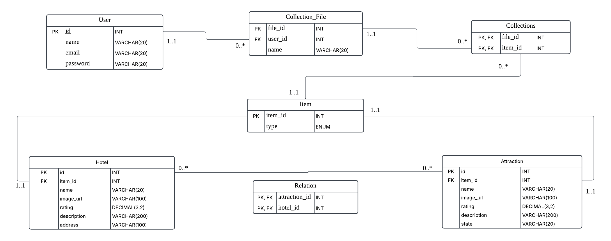

# UML Design

# Assumptions of the UML Diagram

This section describes the assumptions made for each entity in our UML diagram, explaining why they were modeled as entities rather than attributes. Additionally, we provide an overview of the key attributes and relationships, including their cardinality. 

## User

### Assumptions

- The `User` is an independent entity representing the system's users.
- Each `User` can have multiple collection files, but each `Collection_File` belongs to only one `User`.
- The email field must be unique to ensure each user has a distinct identity.

### Key Attributes

- **id**: INT [PK] - Unique identifier for each user.
- **name**: VARCHAR(20) - The user’s name.
- **email**: VARCHAR(50) UNIQUE - A unique email address for user authentication.
- **password**: VARCHAR(100) - Hashed password for security.

### Relationships

**User** and **Collection_File** have a **1-N relationship**, meaning users can create multiple collection files.

## Collection_File

### Assumptions

- A `Collection_File` serves as a container to organize multiple collections.
- Each user can create multiple collection files, but each collection file belongs to exactly one user.

### Key Attributes

- **file_id**: INT [PK] - Unique identifier for each collection file.
- **user_id**: INT [FK to User.id] - The user who owns this collection file.
- **name**: VARCHAR(20) - The name of the collection file.

### Relationships

**Collection_File** and **Collection** have a **1-N relationship**, meaning each collection file can contain multiple collections.

## Collection

### Assumptions

- A `Collection` represents an individual saved item inside a `Collection_File`.
- Each `Collection` must store exactly one `Item`, which could be either a `Hotel` or an `Attraction`.
- The `Collection` table acts as a junction between `Collection_File` and `Item`.

### Key Attributes

- **file_id**: INT [FK to Collection_File.file_id] - The collection file that owns this collection.
- **item_id**: INT [FK to Item.item_id] - The referenced item (either a hotel or an attraction).
- **(file_id, item_id) [PK]** - Composite primary key to ensure that the same item is not stored multiple times within a single collection file.

### Relationships

- **Collection** and **Collection_File** have a **1-N relationship**.
- **Item** and **Collection** have a **1-N relationship**, meaning each `Item` is associated with many `collection` entries.

## Item

### Assumptions

- The `Item` table generalizes both `Hotel` and `Attraction` into a single entity.
- The `type` field differentiates whether the item is a hotel or an attraction.

### Key Attributes

- **item_id**: INT [PK] - Unique identifier for the item.
- **type**: ENUM('Hotel', 'Attraction') - Specifies whether the item is a hotel or an attraction.

### Relationships

- **Item** and **Hotel** have a **1-1 relationship**, ensuring each hotel corresponds to exactly one item.
- **Item** and **Attraction** have a **1-1 relationship**, ensuring each attraction corresponds to exactly one item.

## Hotel

### Assumptions

- The `Hotel` entity stores hotel-specific information.
- Each hotel is linked to an `Item` to unify references in the `Collection` table.

### Key Attributes

- **id**: INT [PK] - Unique identifier for each hotel.
- **item_id**: INT [FK to Item.item_id] - Reference to the corresponding item.
- **name**: VARCHAR(50) - The hotel's name.
- **image_url**: VARCHAR(100) - A link to the hotel's image.
- **rating**: FLOAT - The rating of the hotel.
- **description**: VARCHAR(200) - A description of the hotel.
- **address**: VARCHAR(100) - The physical address of the hotel.

### Relationships

**Hotel** and **Item** have a **1-1 relationship**.

## Attraction

### Assumptions

- The `Attraction` entity stores attraction-specific information.
- Each attraction is linked to an `Item` to unify references in the `Collection` table.

### Key Attributes

- **id**: INT [PK] - Unique identifier for each attraction.
- **item_id**: INT [FK to Item.item_id] - Reference to the corresponding item.
- **name**: VARCHAR(50) - The name of the attraction.
- **image_url**: VARCHAR(100) - A link to the attraction's image.
- **rating**: FLOAT - The rating of the attraction.
- **description**: VARCHAR(100) - A description of the attraction.
- **state**: VARCHAR(50) - The state where the attraction is located.

### Relationships

**Attraction** and **Item** have a **1-1 relationship**.

## Relation (Hotel-Attraction Relationship)

### Assumptions

- The `Relation` table captures the associations between hotels and nearby attractions.
- Since a hotel can be related to multiple attractions and vice versa, this relationship is **many-to-many (M-N)**.

### Key Attributes

- **hotel_id**: INT [FK to Hotel.id] - Associated hotel.
- **attraction_id**: INT [FK to Attraction.id] - Associated attraction.
- **(hotel_id, attraction_id) [PK]** - Composite primary key to prevent duplicate hotel-attraction associations.

### Relationships

**Hotel** and **Attraction** have a **many-to-many (M-N) relationship**, which is managed through the `Relation` entity.

# Normalization of Database

## 1. User Table
**Relation**: $\( R_{User}(id, name, email, password) \)$  
**Primary Key**: $\( id \)$  
**Main Functional Dependency**:  

1. $\( id \rightarrow name, email, password \)  $

Since $\(id\)$ is the sole candidate key, all non-key attributes fully depend on $\(id\)$. There is no partial or transitive dependency. Hence, **User** is in 3NF (and also in BCNF).

## 2. Collection_File Table
**Relation**: $\( R_{CollectionFile}(fileId, userId, name) \)$    
**Primary Key**: $\( fileId \)$    
**Main Functional Dependency**:  
1. $\( fileId \rightarrow userId, name \)$  

All non-key attributes depend on the single key $\(fileId\)$, with no partial or transitive dependencies. Therefore, **Collection_File** is in 3NF (and BCNF).

## 3. Collections Table
**Relation**: $\( R_{Collections}(fileId, itemId) \)$    
**Primary Key**: $\((fileId, itemId)\) (composite key)$    
**Non-key Attributes**: None  

Since this table contains only its composite key and no other attributes, it trivially satisfies both 3NF and BCNF (no non-trivial functional dependencies can violate normal form).

## 4. Item Table
**Relation**: $\( R_{Item}(itemId, type) \)$    
**Primary Key**: $\( itemId \)$    
**Main Functional Dependency**:  
1. $\( itemId \rightarrow type \)$    

There is just one candidate key \(itemId\) and all non-key attributes fully depend on that key. Therefore, **Item** satisfies 3NF (and BCNF).

## 5. Hotel Table
**Relation**: $( R_{Hotel}(id, itemId, name, imageUrl, rating, description, address) )$    
**Declared Primary Key**: $\( id \)$     
**Main Functional Dependencies**:  
1. $\( id \rightarrow itemId, name, imageUrl, rating, description, address \)$  

$\(id\)$  is the only candidate keys of this table. There is no partial or transitive dependency, and no dependency where a non-key attribute determines another non-key attribute. Hence, **Hotel** is in 3NF and also satisfies BCNF.

## 6. Attraction Table
**Relation**: $\( R_{Attraction}(id, itemId, name, imageUrl, rating, description, state) \)$    
**Declared Primary Key**: $\( id \)$    
**Implicit Candidate Key**: $\( itemId \)$   
**Main Functional Dependencies**:  
1. $\( id \rightarrow itemId, name, imageUrl, rating, description, state \) $  

Similar to the **Hotel** table, $\(id\)$ is the only candidate keys, and it fully determines all other attributes. There are no partial or transitive dependencies. Thus, **Attraction** also satisfies 3NF (and BCNF).

## 7. Relation Table
**Relation**: $\( R_{Relation}(attractionId, hotelId) \)$    
**Primary Key**: $\((attractionId, hotelId)\) (composite key)$    
**Non-key Attributes**: None  

Like **Collections**, this table only contains its composite primary key and no additional attributes, so it trivially meets 3NF and BCNF.

## 8. Conclusion
1. Most tables have a single simple primary key (or a composite key with no additional attributes).  
2. No partial or transitive dependencies exist (i.e., we do not see any non-key attribute determining another non-key attribute).  

Therefore, **all tables satisfy 3NF**; because the left-hand side of every nontrivial functional dependency is a (candidate) key in each table, they **also satisfy BCNF**.

# Entity Relationship Description

## 1. User --- Collection_File
- **Cardinality:** One-to-many (1..*)
- **Description:** A user can create multiple collection files, each belonging to one user.

## 2. Collection_File --- Item
- **Cardinality:** One-to-many (1..*)
- **Description:** Each collection file contains multiple collections, and each collection can only belong to one collection file.

## 3. Item --- Collections
- **Cardinality:** Many-to-many (..)
- **Description:** An item can appear in multiple collections, each containing multiple items.

## 4. Item --- Hotel
- **Cardinality:** One-to-one (1..1)
- **Description:** Each item corresponds to one hotel, and each hotel corresponds to one item. There is a one-to-one relationship between items and hotels.

## 5. Item --- Attraction
- **Cardinality:** One-to-one (1..1)
- **Description:** Each item corresponds to one attraction, and each attraction corresponds to one item. There is a one-to-one relationship between items and attractions.

## 6. Hotel --- Relation
- **Cardinality:** One-to-many (1..*)
- **Description:** A hotel can be associated with multiple attractions, meaning several attractions can recommend one hotel. This relationship is represented in the Relation table, where the hotel is connected to multiple attractions.

## 7. Attraction --- Relation
- **Cardinality:** One-to-many (1..*)
- **Description:** An attraction can recommend multiple hotels, meaning one attraction can be associated with multiple hotels. This relationship is also captured in the Relation table, which links the attraction to multiple hotels.

# Relational Schema
- **User**(id:INT [PK], name:VARCHAR(20), email:VARCHAR(20), password:VARCHAR(20))

- **Collection_File**(file_id:INT [PK], user_id:INT [FK to User.id], name:VARCHAR(20))

- **Collections**(file_id:INT [PK, FK to Collection_File.file_id], item_id:INT [PK, FK to Item.item_id])

- **Item**(item_id:INT [PK], type:ENUM)

- **Hotel**(id:INT [PK], item_id:INT [FK to Item.item_id], name:VARCHAR(20), image_url:VARCHAR(100), rating:DECIMAL(3,2), description:VARCHAR(200), address:VARCHAR(100))

- **Attraction**(id:INT [PK], item_id:INT [FK to Item.item_id], name:VARCHAR(20), image_url:VARCHAR(100), rating:DECIMAL(3,2), description:VARCHAR(100), state:VARCHAR(20))

- **Relation**(attraction_id:INT [PK, FK to Attraction.id], hotel_id:INT [PK, FK to Hotel.id])
