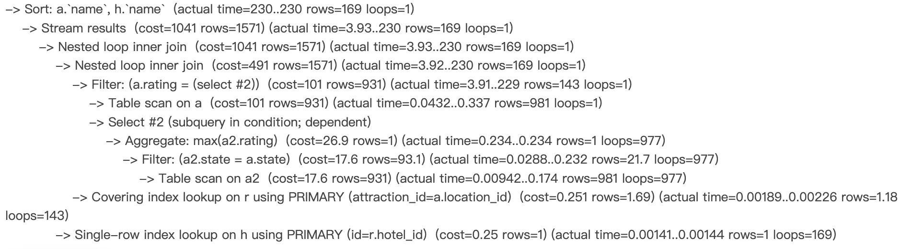
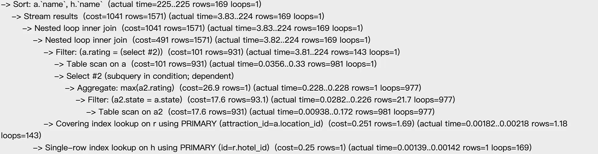
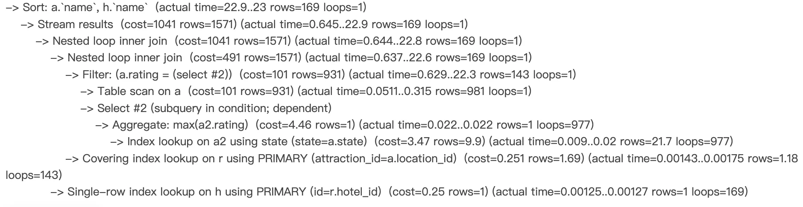
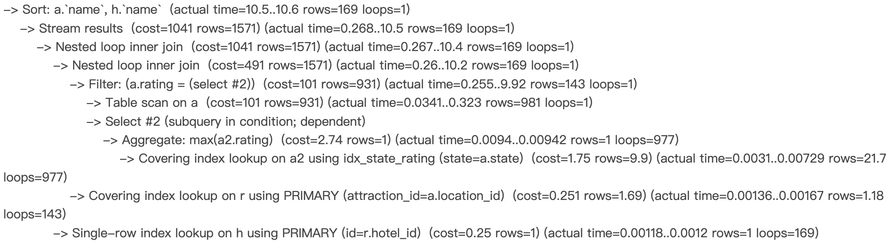

# Database Design Documentation

## Part 1: Relational Schemas and Table Creation

### 1.1 Overview of Relational Schemas
- Brief description of at least 5 relational schemas implemented

### 1.2 Table Creation Statements (DDL)
- `CREATE TABLE` statements for each table (include field names, data types, etc.)

### 1.3 Data Insertion
- Description of inserting at least 1000 rows into each of 3 tables
- Optional: Description of how the data was generated

---

## Part 2: Advanced SQL Queries

### 2.1 Query 1
**Query description**  
This query retrieves the top 15 hotels that have received the most collections from users, only considering hotels with a rating above 4.0. It joins the `Hotel`, `Item`, and `Collections` tables to connect hotel data with user collection activity, and then groups by hotel to aggregate the total number of collections and compute the average rating.

**SQL concepts used**  
- **Multiple Joins** (JOIN `Hotel` ↔ `Item` ↔ `Collections`)  
- **WHERE** (filters hotels by rating > 4.0)  
- **GROUP BY** (groups results by hotel)  
- **Aggregation** (`COUNT()`, `AVG()`)  
- **ORDER BY** (sorts by times_collected in descending order)  
- **LIMIT** (retrieves the first 15 rows)

**SQL statement**  
```sql
SELECT 
    h.name, 
    h.address,
    COUNT(c.item_id) AS times_collected,
    AVG(h.rating) AS avg_rating
FROM Hotel h
JOIN Item i ON h.item_id = i.item_id
JOIN Collections c ON c.item_id = i.item_id
WHERE h.rating > 4.0
GROUP BY h.id
ORDER BY times_collected DESC
LIMIT 15;
```


### 2.2 Query 2
**Query description**  
This query finds all hotels that are associated with the “highest-rated” attractions within each state. It uses a **subquery** to determine the maximum rating in that attraction’s state and filters any attractions whose rating matches that maximum value. Then, by joining `Hotels`, `Relations`, and `Attractions`, it retrieves the corresponding hotel names alongside those top-rated attractions.
**SQL concepts used**  
- **Multiple Joins**: (`Hotels` ↔ `Relations` ↔ `Attractions`)  
- **Subquery**: `SELECT MAX(a2.rating) FROM Attractions a2 WHERE a2.state = a.state`  
- **Filtering with a Subquery Result**: Compares the current row’s `a.rating` to the subquery’s maximum rating  
- **ORDER BY**: Sorts the final list by `AttractionName` and then `HotelName`
**SQL statement**  
```sql
SELECT
    a.name AS AttractionName,
    h.name AS HotelName
FROM Hotels h
JOIN Relations r
    ON h.id = r.hotel_id
JOIN Attractions a
    ON a.location_id = r.attraction_id
WHERE
    a.rating = (
        SELECT MAX(a2.rating)
        FROM Attractions a2
        WHERE a2.state = a.state
    )
ORDER BY AttractionName, HotelName;
```
### 2.3 Query 3
- Same structure as above

### 2.4 Query 4
- Same structure as above

---

## Part 3: Indexing and Optimization

### 3.1 Index Analysis for Query 1
- `EXPLAIN ANALYZE` results before and after indexing
- Explanation of index design and its effect

### 3.2 Index Analysis for Query 2
- Same structure as above

### 3.3 Index Analysis for Query 3
#### No index


#### index Attractions.name

> explanation
- It does not have a significant improvement. Although the leaf nodes of a B+ Tree form a linked list, which is generally efficient for ordered retrieval, the execution analyze shows that the optimizer did not use the index for sorting. This is likely because the number of output rows is relatively small, making the cost of using the index higher than simply performing a sort in memory.</br>

#### index Attractions.state

> explanation
- It significantly reduces the search cost. Without the index, the subquery must perform a full table scan on the Attractions table. With the index, the executor can quickly locate the matching state values, narrowing down the number of rows to scan.</br>

#### index Attractions.state, Attractions.rating

> explanation
- We ultimately chose to use a composite index. By including rating in the index, it enables a covering index lookup for the subquery. This allows the executor to retrieve the required rating values directly from the index, without accessing the primary B+ tree, which improves the efficiency of the MAX() aggregation.</br>

### 3.4 Index Analysis for Query 4
- Same structure as above

---

## Part 4: Appendix

### 4.1 Database Deployment Screenshot
- Screenshot of terminal showing database creation locally or on GCP

### 4.2 Additional Notes
- Optional: Notes, data generation scripts, or external links

