# Database Design Documentation

## Part 1: Relational Schemas and Table Creation

### 1.1 Overview of Relational Schemas
- Brief description of at least 5 relational schemas implemented

### 1.2 Table Creation Statements (DDL)
- `CREATE TABLE` statements for each table (include field names, data types, etc.)

### 1.3 Data Insertion
- Description of inserting at least 1000 rows into each of 3 tables
- Optional: Description of how the data was generated

---

## Part 2: Advanced SQL Queries

### 2.1 Query 1
**Query description**  
This SQL query retrieves each state’s total number of attractions, average attraction rating, total number of hotels, and average hotel rating. It filters out states with fewer than three attractions and orders the results by the highest average attraction rating, limiting the output to the top 15 rows.


**SQL Concepts Used**  
1. **SELECT**: Retrieves specific columns and applies aggregate functions (`COUNT`, `AVG`).
2. **JOIN**:  
   - Uses `Relations` as a bridge to connect `Attractions` (`a`) and `Hotels` (`h`).
3. **GROUP BY**: Groups rows by `a.state` to perform aggregate calculations on each state.
4. **DISTINCT**: Ensures that repeated location IDs and hotel IDs are only counted once.
5. **HAVING**: Filters groups (states) to include only those with at least three unique attractions.
6. **ORDER BY**: Sorts the results in descending order of average attraction rating.
7. **LIMIT**: Restricts the result set to 15 rows.


**SQL statement**  
```sql
SELECT
    a.state,
    COUNT(DISTINCT a.location_id) AS total_attractions,
    AVG(a.rating) AS avg_attraction_rating,
    COUNT(DISTINCT h.id) AS total_hotels,
    AVG(h.rating) AS avg_hotel_rating
FROM
    Attractions a
JOIN
    Relations r ON a.location_id = r.attraction_id
JOIN
    Hotels h ON r.hotel_id = h.id
GROUP BY
    a.state
HAVING
    COUNT(DISTINCT a.location_id) >= 3
ORDER BY
    avg_attraction_rating DESC
LIMIT 15;
```
**Query result**  
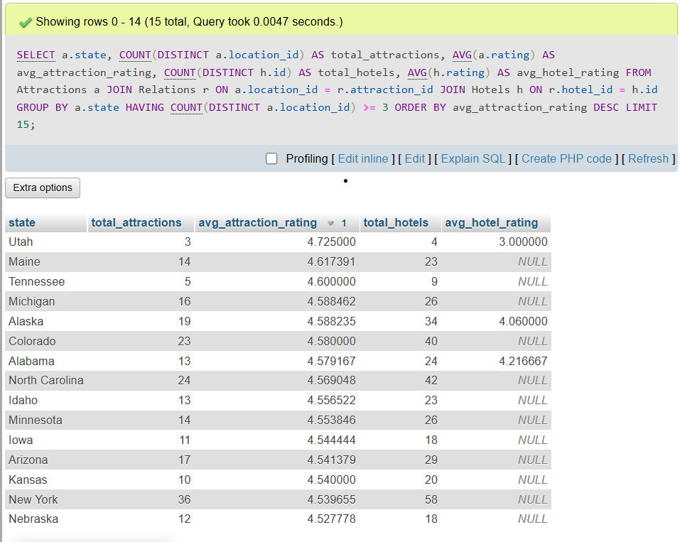

### 2.2 Query 2
**Query description**  
This query expands the basic user-collection lookup by also counting how many items exist in each collection. Given a specific username (e.g., `'user1'`), it joins `User` and `Collection_File`, then **LEFT JOINs** the `Collections` table to count how many `item_id` entries appear in each collection. This ensures we have both **JOIN** and **GROUP BY** to meet advanced query requirements.

**SQL concepts used**  
- **Multiple Joins**: Joins `User` → `Collection_File` → (optionally) `Collections`  
- **GROUP BY**: Groups results by `cf.file_id` to aggregate the total items per collection  
- **COUNT()**: Counts the number of items in each collection  
- **WHERE**: Filters by a specific username  
- **LIMIT**: Returns only the first 15 rows

**SQL statement**  
```sql
SELECT
    u.name AS username,
    cf.file_id,
    cf.name AS collection_name,
    COUNT(c.item_id) AS total_items
FROM User u
JOIN Collection_File cf 
    ON u.id = cf.user_id
LEFT JOIN Collections c
    ON cf.file_id = c.file_id
WHERE u.name = 'user1'
GROUP BY cf.file_id
ORDER BY total_items DESC
LIMIT 15;
```

**Query 2 Result Note**  
The result of this query includes only **2 rows**, instead of 15. This is because the user `'user1'` has relatively few saved collections. According to their usage pattern, they do not frequently browse or engage with the website, leading to fewer entries being retrieved in the query.
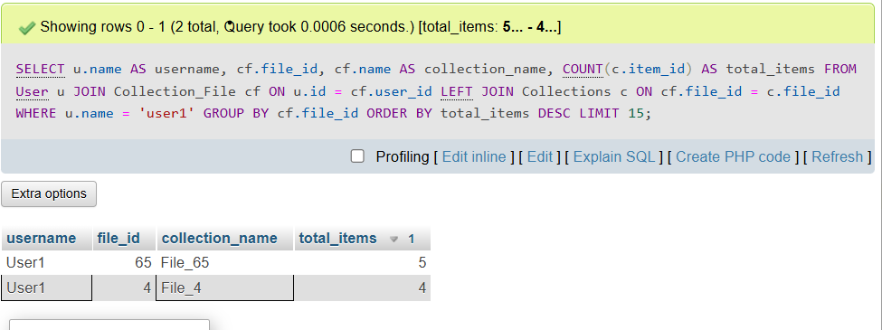

### 2.3 Query 3

**Query description**  
This query finds all hotels that are associated with the “highest-rated” attractions within each state. It uses a **subquery** to determine the maximum rating in that attraction’s state and filters any attractions whose rating matches that maximum value. Then, by joining `Hotels`, `Relations`, and `Attractions`, it retrieves the corresponding hotel names alongside those top-rated attractions.

**SQL concepts used**  
- **Multiple Joins**: (`Hotels` ↔ `Relations` ↔ `Attractions`)  
- **Subquery**: `SELECT MAX(a2.rating) FROM Attractions a2 WHERE a2.state = a.state`  
- **Filtering with a Subquery Result**: Compares the current row’s `a.rating` to the subquery’s maximum rating  
- **ORDER BY**: Sorts the final list by `AttractionName` and then `HotelName`

**SQL statement**  
```sql
SELECT
    a.name AS AttractionName,
    h.name AS HotelName
FROM Hotels h
JOIN Relations r
    ON h.id = r.hotel_id
JOIN Attractions a
    ON a.location_id = r.attraction_id
WHERE
    a.rating = (
        SELECT MAX(a2.rating)
        FROM Attractions a2
        WHERE a2.state = a.state
    )
ORDER BY AttractionName, HotelName
LIMIT 15;
```

**Query result**  
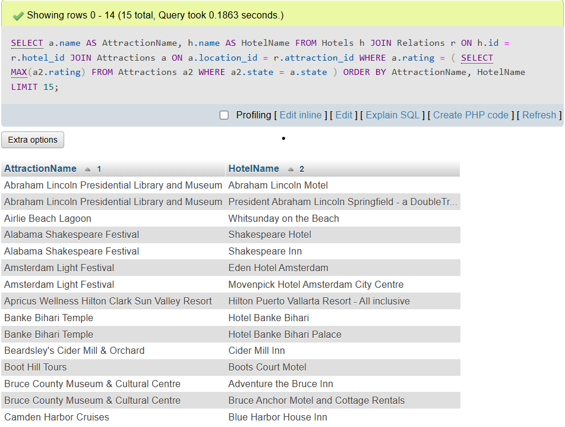

### 2.4 Query 4

**Query description**  
This query merges two result sets into a single list using the **UNION** operator. The first part selects hotels with ratings >= 4.0, and the second part selects attractions with ratings >= 4.5. Both sets share the same output columns (`type`, `place_name`, `rating`), allowing a combined “high-rated recommendation list.” The results are then ordered by rating in descending order and limited to the top 15 rows.

**SQL concepts used**  
- **SET Operator (UNION)**: Combines rows from two SELECT statements into one result set  
- **WHERE**: Filters results based on the hotel or attraction ratings  
- **ORDER BY**: Sorts all combined rows by rating  
- **LIMIT**: Restricts the result to 15 rows

**SQL statement**  
```sql
SELECT 'Hotel' AS type, h.name AS place_name, h.rating
FROM Hotels h
WHERE h.rating >= 4.0

UNION

SELECT 'Attraction' AS type, a.name AS place_name, a.rating
FROM Attractions a
WHERE a.rating >= 4.5
ORDER BY rating DESC
LIMIT 15;
```

**Query result**  
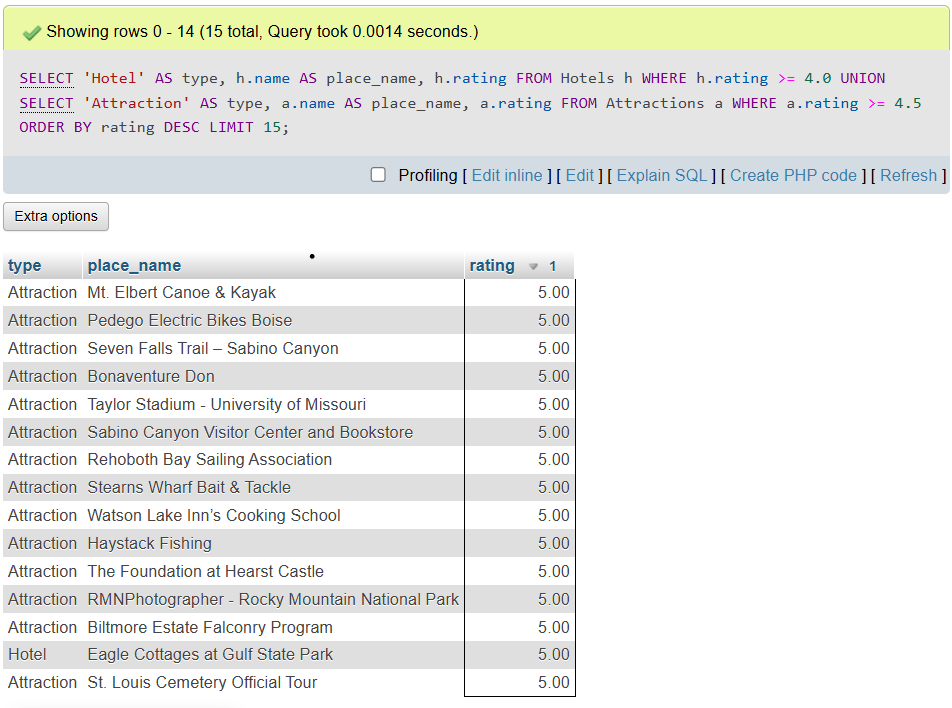

## Part 3: Indexing and Optimization

### 3.1 Index Analysis for Query 1

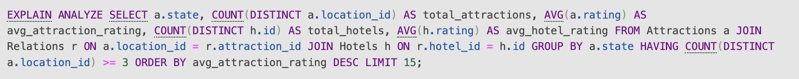

#### Baseline

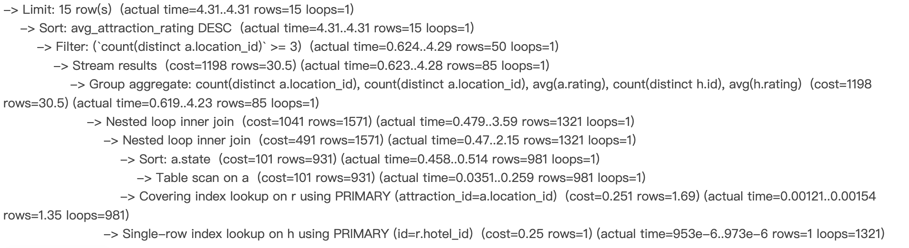

#### Index on Attractions(state)

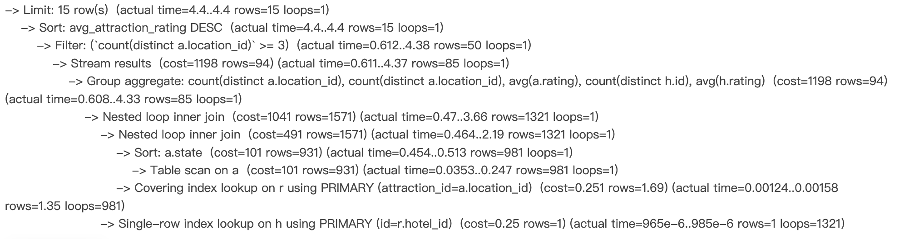

##### Explanation

The index on state provides a minor improvement by slightly accelerating the GROUP BY operation. However, due to low selectivity and full-table grouping, the overall benefit is marginal.

#### Index on Attractions(state, rating)

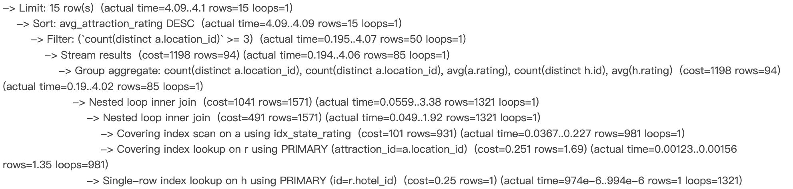

##### Explanation

This compound index provides access to both the state and rating columns, allowing MySQL to optimize the GROUP BY state and aggregation (AVG(rating)) together. Compared to the single-column state index, this index enables a **covering index scan**, which improves locality and reduces data access overhead. While the gain is modest, this index design is useful for aggregation-heavy queries involving both grouping and value computation on the same table.

#### Index on Hotels(rating)

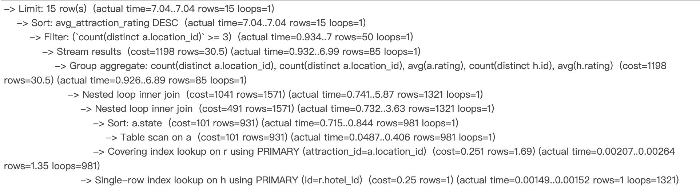

##### Explanation

This index degraded performance due to the overhead of using the rating index in an aggregation-only context.   Since no filtering is applied on rating, and the dataset is small, this index introduces unnecessary complexity.

### 3.2 Index Analysis for Query 2

- Same structure as above

### 3.3 Index Analysis for Query 3
#### Baseline


#### Index on Attractions.name

> explanation
- It does not have a significant improvement. Although the leaf nodes of a B+ Tree form a linked list, which is generally efficient for ordered retrieval, the execution analyze shows that the optimizer did not use the index for sorting. This is likely because the number of output rows is relatively small, making the cost of using the index higher than simply performing a sort in memory.</br>

#### Index on Attractions.state

> explanation
- It significantly reduces the search cost. Without the index, the subquery must perform a full table scan on the Attractions table. With the index, the executor can quickly locate the matching state values, narrowing down the number of rows to scan.</br>

#### Index on Attractions.state, Attractions.rating

> explanation
- We ultimately chose to use a composite index. By including rating in the index, it enables a covering index lookup for the subquery. This allows the executor to retrieve the required rating values directly from the index, without accessing the primary B+ tree, which improves the efficiency of the MAX() aggregation.</br>

### 3.4 Index Analysis for Query 4
#### No index
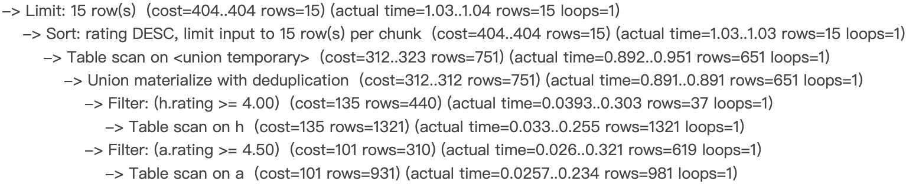

#### index Attractions.rating
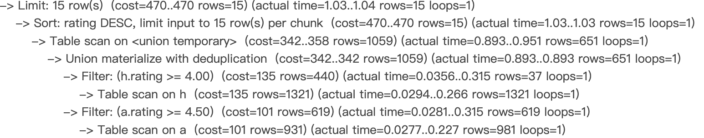
> explanation
- Adding Attractions.rating only may cause the worst performance, the presence of the index caused the planner to overestimate the number of qualifying rows, leading to higher estimated costs for deduplication and sorting in the union operation.

#### index Hotel.rating
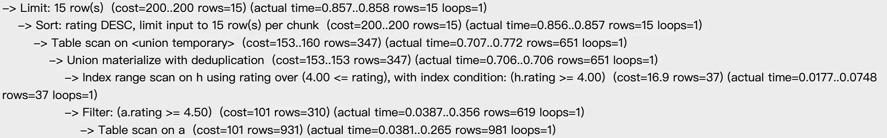
> explanantion
- Indexing Hotels.rating resulted in the best performance. It is used very effectively, as the filtering condition was very selective, significantly reduced the number of rows early in the execution. 

#### index Hotel.rating, Hotel.name
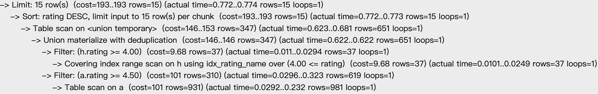
> explanantion
- We ultimately chose to use this composite index. Beside the benefit of indexing Hotel.rating, it also provides the covering index lookup for name, so the executor does not have the need to accessing the primary B+ tree, improving the efficiency.

---

## Part 4: Appendix

### 4.1 Database Deployment Screenshot
- Screenshot of terminal showing database creation locally or on GCP

### 4.2 Additional Notes
- Optional: Notes, data generation scripts, or external links

